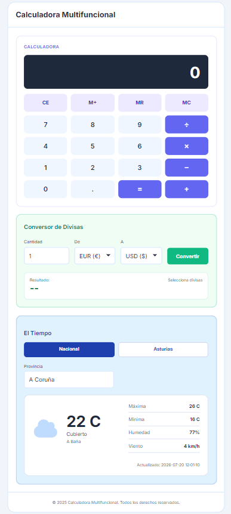
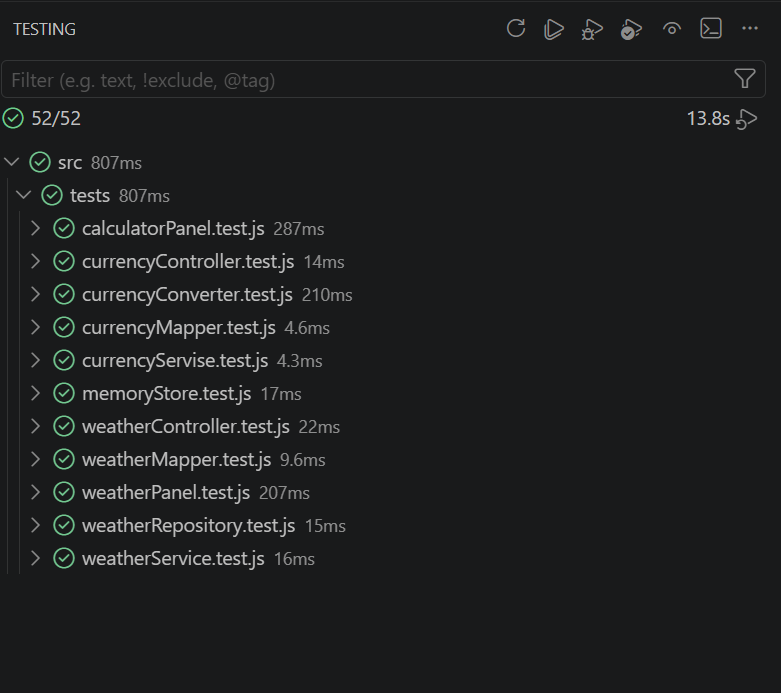
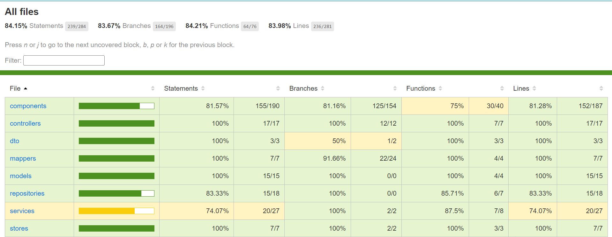

# Multifunctional Calculator

A Vue 3 application that combines a basic calculator, a currency converter, and a weather module in a single responsive view.

## Preview



## Features

### Calculator

- Basic operations: addition, subtraction, multiplication, and division.
- Numeric buttons from 0 to 9.
- Decimal button.
- CE button to reset the calculator.
- Error handling for invalid operations, including division by zero.
- Memory functionality using Pinia:
  - M+ adds the current number to memory.
  - MR recalls the stored value.
  - MC clears the stored value.

### Currency Converter

- Integrated currency converter.
- Supported currencies:
  - Euro (EUR)
  - US Dollar (USD)
  - Japanese Yen (JPY)
- Currency data fetched with Axios from the CurrencyFreaks API.
- Amount validation.
- Loading and error handling.

### Weather Module

- Weather data fetched with Axios from the el-tiempo.net API.
- National and Asturias modes.
- Municipality selection for Asturias.
- Weather SVG icon changes according to the sky state.
- Loading and error handling.

## Requirements Covered

- Vue 3 application.
- Single-page layout without Vue Router.
- Mobile-first responsive design.
- Basic calculator with addition, subtraction, multiplication, and division.
- Required calculator buttons: 0-9, +, -, multiplication, division, equals, decimal point, and CE.
- Error handling for invalid operations, including division by zero.
- Currency converter integrated into the app.
- EUR, USD, and JPY currency support.
- CurrencyFreaks API integration with Axios.
- Weather module using the el-tiempo.net API.
- Weather icon changes according to the sky state.
- Pinia memory functionality with M+, MR, and MC.
- Unit and component tests with Vitest and Vue Test Utils.
- E2E tests with Playwright.
- Deployment with GitHub Pages and GitHub Actions.

## Tech Stack

- Vue 3
- Vite
- Pinia
- Axios
- Sass
- Vitest
- Vue Test Utils
- Playwright
- GitHub Pages
- GitHub Actions

## Architecture

The project follows a layered structure:

```text
View
Controller
DTO
Mapper
Model
Service
Repository
External API
```

Example for the currency converter:

```text
CurrencyConverter.vue
currencyController.js
currencyRatesDto.js
currencyMapper.js
currencyRates.js
currencyService.js
currencyRepository.js
CurrencyFreaks API
```

This structure separates the UI, validation, data transformation, business logic, and API access.

## Project Structure

```text
src/
  assets/
    weather/
  components/
  controllers/
  dto/
  mappers/
  models/
  repositories/
  services/
  stores/
  styles/
  tests/
e2e/
docs/
.github/
  workflows/
```

## Installation

```bash
npm install
```

## Development

```bash
npm run dev
```

## Production Build

```bash
npm run build
```

## Unit Tests

```bash
npm run test:unit -- --run
```

## Test Coverage

```bash
npm run test:coverage
```

Current coverage:

```text
Statements: 84.15%
Branches: 83.67%
Functions: 84.21%
Lines: 83.98%
```

## Testing Summary

The project includes unit tests, component tests, and E2E tests.

- Unit and component tests: Vitest and Vue Test Utils.
- E2E tests: Playwright.
- Total tests: 52.
- Coverage: over 84%.

## E2E Tests

Install Playwright browser dependencies before the first run:

```bash
npx playwright install chromium
```

Run E2E tests:

```bash
npm run test:e2e -- --project=chromium
```

## Testing Evidence

### Tests Passed



### Coverage Report



## Deployment

The application is deployed automatically with GitHub Actions.

Every push to the `main` branch runs the production build with Vite, injects the required environment variables from GitHub Secrets, and publishes the `dist` folder to GitHub Pages.

The deployment workflow is located at:

```text
.github/workflows/deploy.yml
```
